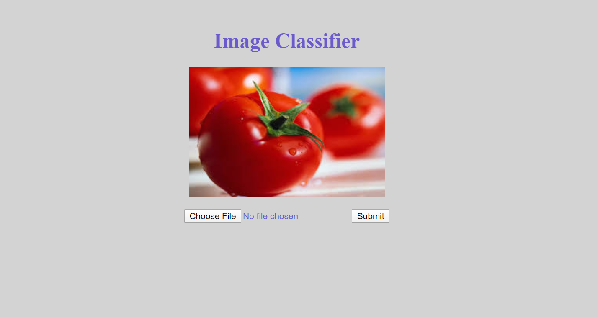
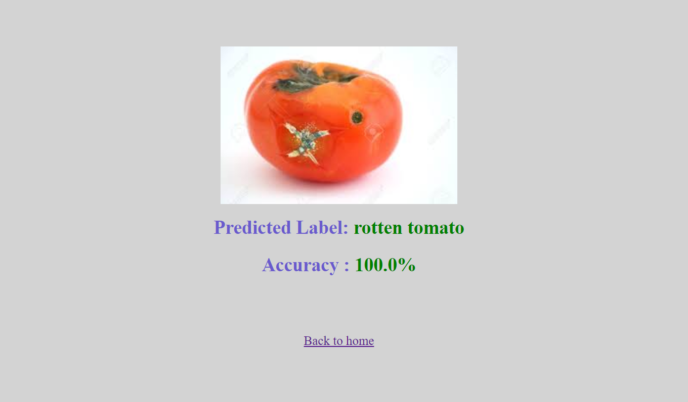
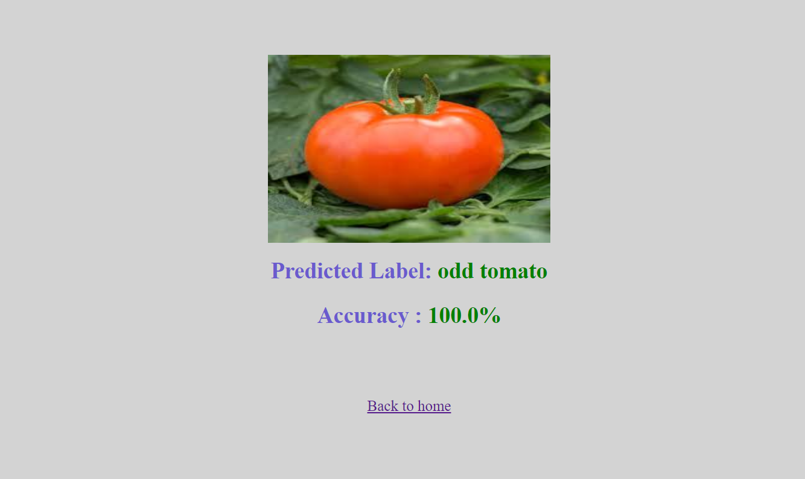

# Odd-tomatoes-vs-Rotten-tomatoes-web-application-using-Flask

# FLASH APPLICATION #


### How to use ###

* In order to run our model on a Flask application locally, you need to clone this repository and then set up the environment by these    following commands:

* On the Terminal, use these commands:

```
    export FLASK_APP=app.py
    flask run --host=0.0.0.0
```

* On the Anaconda Prompt

```
    python app.py
    
```


### Home Page ###

<p align="center">



</p>

### Example of results ###

<p align="center">




</p>
